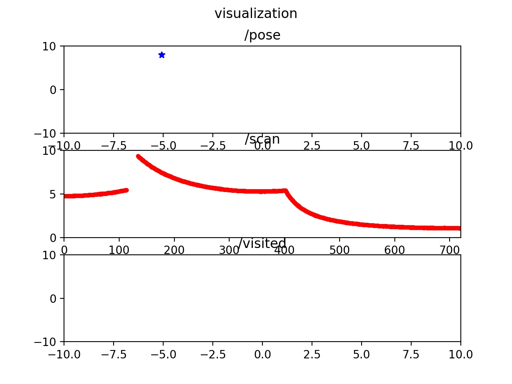
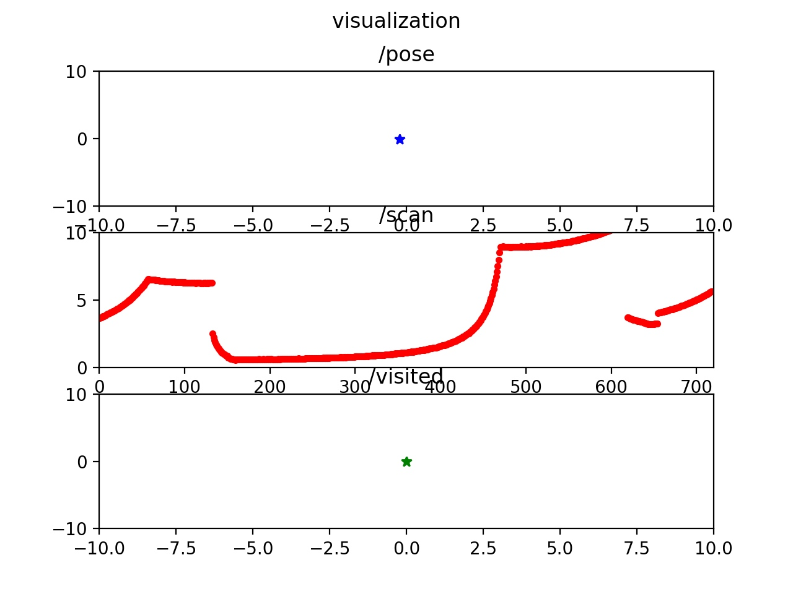

Research Track 2nd assignment 1
by:
Zhouyang Hong
s5197402

# Code comment
Inside the folder comment code/ you are able to find this file "html/_u_i_8py.html" just open it and the comments of code will show up. The comments is done by Doxygen and UI.py is the source file which contains both code and comments.

# Jupyter UI
In this part, when you succeeded of executing the code, first you shall see something like this.

if you choose mode 1 and set some targets, then the 3rd plot will show some green dots, which represents the visited point as below.

in order to be able to run the jupyter interface, first we need to run the environment.
    go to the ros_work_space/src
    git clone https://github.com/CarmineD8/final_assignment.git
    back to ros_work_space/ run catkin_make
    run roslaunch final_assignment simulation_gmapping.launch 
    open another terminal
    run roslaunch final_assignment move_base.launch 
    now enter the folder JUpyter notebook UI/ and open termianal run command:   
    jupyter notebook --allow-root --ip 0.0.0.0 
    enter /RT2nd_ass1.ipynb and run the code on explorer.
    
    
# Analysis
   In this part, I used 2-sample T-test to analyze the time costs between my code and Carmine's code. Since 10 silver tokens are randomly placed on the map, so a lot of unexpected things happened. Like go grabbing silver tokens on the middle, which is inside the wall but the robot still trys to across the wall to grab it, and also go backward before finishing a complete loop. Sometimes it even costs me half hour to collect a valid data, that's why I choose to use T-test instead of Z-test.
    inside Analysis/ you can find Zhouyang_report.pdf, which is the details of this test.
    
    
    
